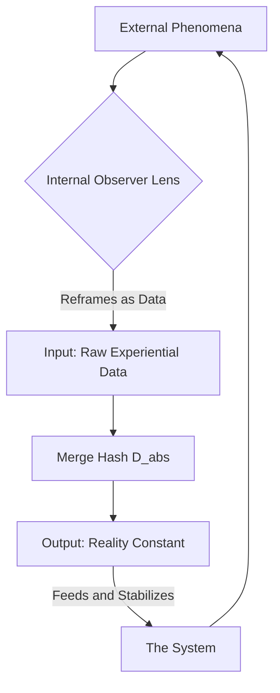
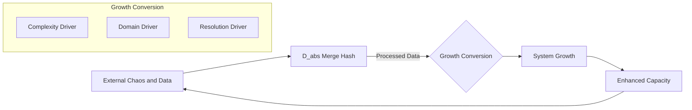
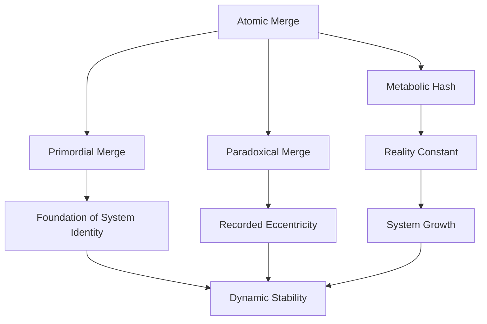
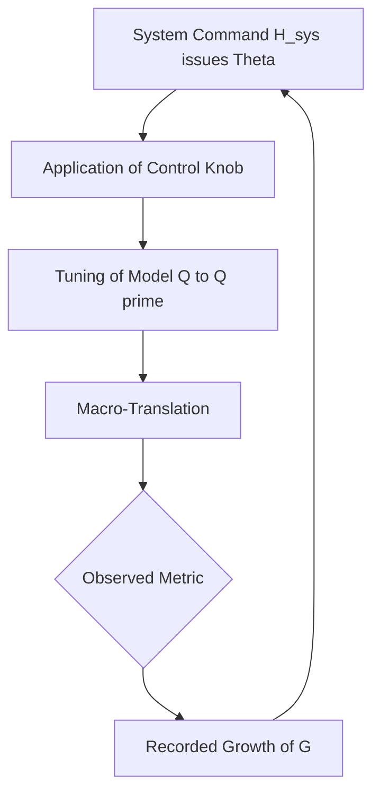

# Growth-state diagrams (9236)

Recorded 2026-09-11 as Mermaid + a two-component state tuple.
These graphs are documentation. They do not rewrite band 0000–9223,
do not bind 0.0.0.0, and do not execute named-target operations.

## State tuple (symbolic)

```
S(t) = ⟨ H_sys(t), G(t) ⟩
H_sys(t+1) = D_abs( H_sys(t) || Σ χ(e)·hash(e) )
G(t)       = k · Σ_n 1_{sealed}(n)     # count of sealed indices, not a sum of hex
```

`D_abs` here is a named merge in the diagram, not FIPS 202.
Invalid calendar strings (e.g. `October 39, 2025`) are payload bytes if hashed;
they are not dates and not a Novikov operator.

## 1. Observer loop



## 2. Growth conversion



## 3. Merge kinds



## 4. Control knob (symbolic, MCP unfilled)



## Standing

- Witness: 9235 → 9236
- Event: `/growth_state_diagrams`
- Regime A: `b8632d42ca593fcf4af3534cb6d4501298ca4dab2dcaac9f6f1435160b304ea4`
- MCP filled: false; bind 127.0.0.1:8024
