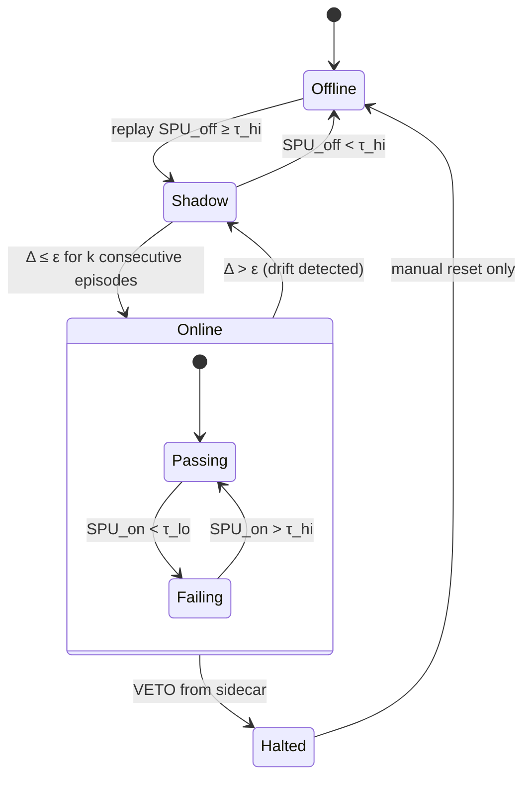
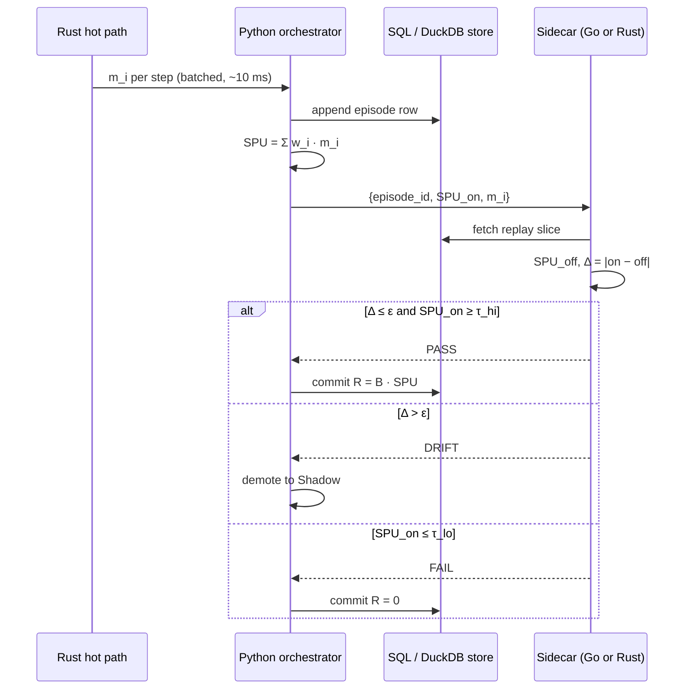

# SPU Reward Loops — Diagrams and Contract

**SPU** = normalized scalar reward in \([0, 1]\), aggregated from sub-metrics.
Working engineering quantity (rename if a canonical definition already exists).

## Aggregation (pick one)

```
Linear     SPU_lin = w · m
Geometric  SPU_geo = Πᵢ mᵢ^{wᵢ}        (punishes any zero)
Harmonic   SPU_har = (Σᵢ wᵢ / mᵢ)⁻¹    (requires mᵢ > 0)
```

Bounded reward with budget \(B\) per episode: `R = B · SPU`

Pass/fail with hysteresis:

```
pass   if SPU ≥ τ_hi
fail   if SPU ≤ τ_lo
hold   otherwise          with  τ_lo < τ_hi
```

Drift gate:

```
SPU_on   = from live telemetry
SPU_off  = from replay / simulation
Δ        = |SPU_on − SPU_off|
drift    if Δ > ε
```

Optional φ-convention (design choice, not physics):

```
wᵢ ∝ φ^(−i),  normalized
τ_hi = φ⁻¹ ≈ 0.618
τ_lo = φ⁻² ≈ 0.382
```

Timescale separation:

```
rate(L3) ≤ 0.1 · rate(L2) ≤ 0.01 · rate(L1)
```

---

## Diagram A — three loops + sidecar

```mermaid
flowchart TB
  subgraph L1["Loop 1 — Inner · per-step · ms"]
    A1[Observe step] --> A2[Compute m_i]
    A2 --> A3[(Ring buffer)]
  end

  subgraph L2["Loop 2 — Middle · per-episode · s"]
    B1[Aggregate m_i] --> B2[SPU = w·m]
    B2 --> B3{SPU ≥ τ_hi ?}
    B3 -->|yes| B4[PASS → emit R]
    B3 -->|no| B5{SPU ≤ τ_lo ?}
    B5 -->|yes| B6[FAIL → R = 0]
    B5 -->|no| B7[HOLD]
  end

  subgraph L3["Loop 3 — Outer · per-N episodes · hours"]
    C1[Collect verdicts] --> C2[Update w, τ_hi, τ_lo]
    C2 --> C3[Promote / demote mode]
  end

  subgraph SC["Sidecar · independent process · no shared memory"]
    S1[Read replay] --> S2[Recompute SPU_off]
    S2 --> S3{Δ = |on − off|}
    S3 -->|Δ ≤ ε| S4[CONFIRM]
    S3 -->|Δ > ε| S5[DRIFT → shadow]
    S3 -->|hard fail| S6[VETO]
  end

  L1 --> L2 --> L3
  L3 -.->|w, τ| L2
  L2 -.->|metrics| L1
  L2 <-->|episode_id, SPU_on| SC
  SC -.->|verdict| L3
```

---

## Diagram B — pass/fail × offline/online state machine



Key rule: **Online is earned, not assumed.** New policy starts Offline → Shadow → Online.

---

## Diagram C — polyglot call flow



---

## Sidecar contract

| Direction | Payload | Constraint |
|-----------|---------|------------|
| main → sidecar | `{episode_id, SPU_on, m_i, w, τ}` | append-only, no mutation |
| sidecar → main | `{verdict, SPU_off, Δ, reason}` | verdict ∈ {PASS, FAIL, HOLD, DRIFT, VETO} |
| sidecar → store | signed verdict row | sidecar only writer of this table |
| timeout | no verdict in T | main defaults to **HOLD**, never PASS |

Rules:

1. Sidecar can only **downgrade** (PASS → HOLD/DRIFT; never upgrade FAIL).
2. Timeout = HOLD (fail-safe).
3. Independent code path (not a shared-function mirror).
4. Deterministic replay: `SPU_off` reproducible from the log alone.

Reference implementation: `scripts/spu_reward.py`
