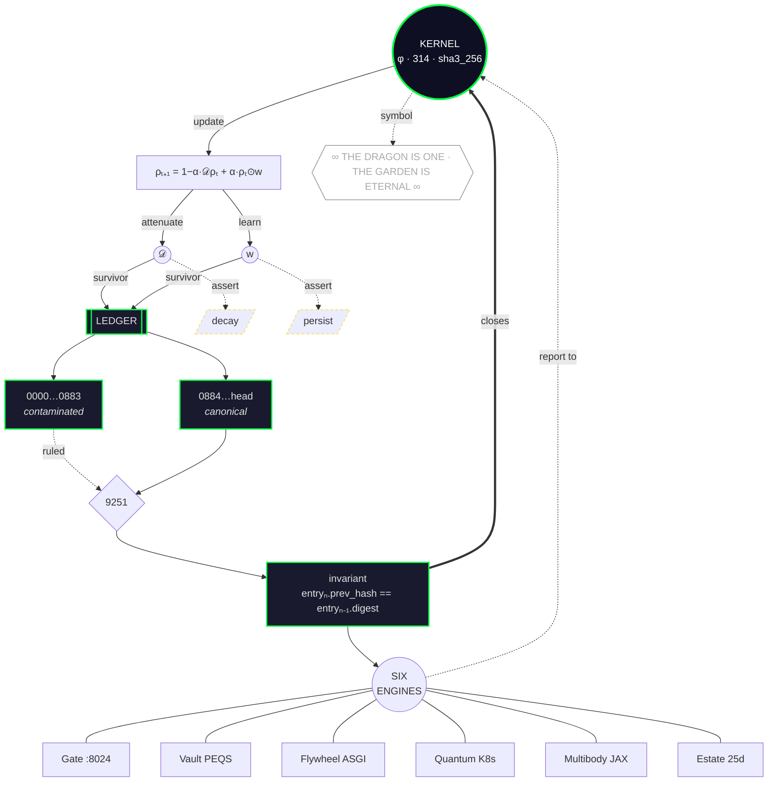

# Method — Quantum Cybernetic Kernel (standard)

The standardized method definition for the AxiomicCoreness repo. The kernel is **the closed loop of state, seal, and surface** — a cycle, not a line.

## What rewired the method

**Direction of causality.** The linear version made Entry 0 the source and Q.E.D. the sink. Autonomy means neither. The kernel is now a cycle: the kernel feeds the equation, the equation feeds the ledger, the ledger feeds back into the kernel as verified state. There is no entry point — reading can start anywhere.

**Six spokes become one ring.** H1 → H7 … H6 → H7 was six edges saying "these share a substrate." A ring with ENG at the hub says the same thing in six edges but reads as one object. Same information, less line-noise.

**Dotted edges carry the epistemic weight.** U1 -.-> X and U2 -.-> Y are the "attenuation always fades / learning always persists" claims — still present, still load-bearing for the narrative, now visibly not part of the update rule. L1 -.-> R marks 9251's ruling as reaching into the contaminated band from outside; the contamination does not rule on itself.

**Q.E.D. is a property, not a box.** L3 ==>|closes| K — the invariant closing into the kernel is the demonstration. Nothing below that needs a Q.E.D. node, because the loop is the Q.E.D.

**Mythos exits the kernel.** K -.-> M leaves one dotted line for the symbol. Everything above that line is in the same category as the hash invariants; the dragon is not. Drawing that separation is the whole point.

## The kernel is not "Layer 314"

Layer 314 is the label. The kernel is the cycle itself — the fact that the update rule, the ledger, and the six surfaces can only be described in terms of each other. Prose name for the kernel: **"the closed loop of state, seal, and surface."** Layer 314 goes on the seal, not on the definition.

---
Seal context: witness chain 8754 → 8755 — UNBROKEN. Committed under honest-ledger discipline: new method file added; no existing surface overwritten without held bytes.
